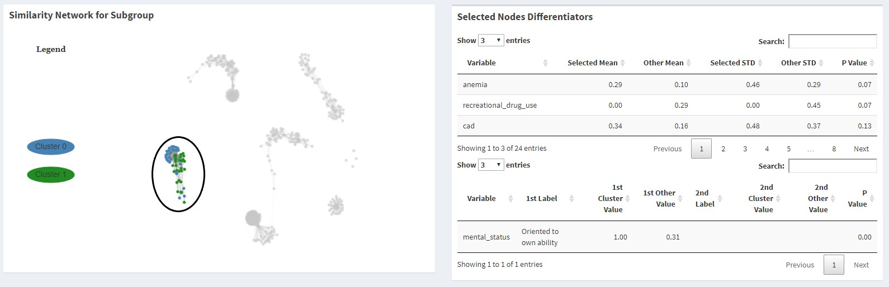
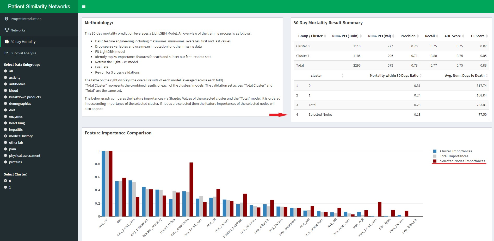
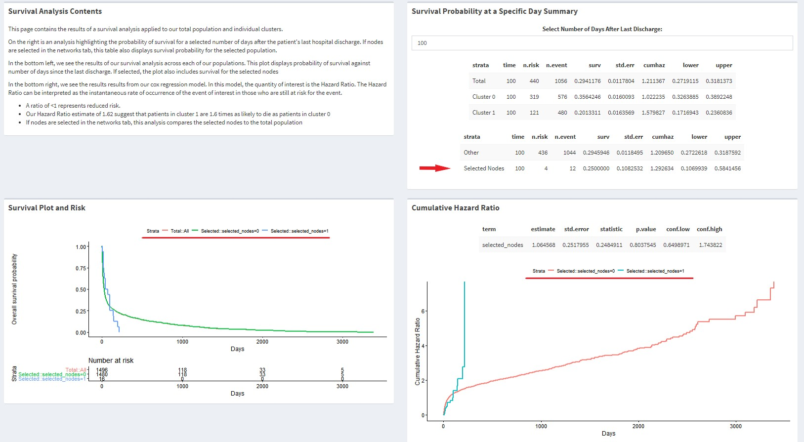

# Patient Similarity Networks
Interactively click through patient subpopulations utilizing networks based on patient similarity across a variety of features. 

[[insert demo or gif]]

## Overview of the Application
This application utilizes patient similarity networks ("PSN") to let the user interactively explore patient subpopulations found in chronic liver disease patients from the MIMIC-III database. In PSNs, each node represents a patient and each edge between two patients represents their similarity for that particular set of data. By measuring similarity between each patient to patient combination across a variety of data subgroups, the application displays a network of patients that is both interpretable and accessible.

The application (contained in the Shiny folder) consists of four tabs:
  * Project Introduction
  * Patient Similarity Networks and Comparisons of Subpopulations
  * 30-day Mortality Prediction Model
  * Survival Analysis 

Initial analysis identifies two core clusters within this population. All default analyses are split based on these two clusters. 

The "Project Introduction" tab contains information related to the overall project including methodology, overview of patient similarity networks, and contents of the application. 

The second tab ("Networks") allows the user to quickly cycle through each of the patient similarity networks and identify what makes the selected cluster unique for that particular subgroup.  For example, if the user is curious about patient medical history, they can display the PSN for medical history and review the results of the statistical tests for just the variables within that specific subgroup. A screenshot of this is displayed below. 

*Screenshot of the interactive application’s ‘Networks’ tab currently viewing the “medical history” data subgroup. The top left box displays the selected PSN. The two bottom boxes display the statistical test results for numeric (left) and categorical (variables). These are ordered by level of statistical significance. The top right box is left blank because no specific subpopulations have been selected.*

The third tab ("30-day Mortality") displays the results of the 30-day prediction model. A LightGBM model is used to predict whether a patient dies 30 days after their last hospital discharge. 

*Screenshot of the interactive application’s “30-day Mortality” tab, where I display results pertaining to our 30 day mortality prediction model. The top left box displays methodology information. The top right box displays the efficacy results of our prediction model and summary statistics of the percent of patients who die within 30 days and the average time to death for patient. The bottom box displays the mean Shapley values (feature importance scores) for the selected cluster and the total population.*

The fourth and final tab displays the results of a survival analysis.  A survival analysis results in a probability of survival for patients at any given day after their last follow-up.

*Screenshot of the applications “Survival Analysis” tab, where I display results related to patient subpopulation’s probability of survival at any given point in time after their last hospital discharge. In the top right box, I display a detailed summary of probability of survival for a specific number of days post last discharge – the user has the option to select the number of days. In the bottom left, I display the survival plot and in the bottom right, I display the summary of the Cox regression and the cumulative hazard plot. *

## Exploration Patient Subpopulations
While using the application, if the user identifies a smaller cluster that they are curious about.  they can click into it, compare it to the general population, and evaluate their results in downstream tasks.  Continuing with the “medical history” example above, I display an example of clicking one of the smaller clusters. A screenshot of this is displayed below. 

*screenshot after selecting a random subpopulation using the “medical history” subgroup.  We can see that this patient population is characterized by higher rates of anemia and coronary artery disease than the general chronic liver disease population.*

For this selected patient subpopulation, we can also review their results within our downstream prediction task. The next two screenshots display results for this subpopulation in the 30-day mortality prediction and survival outcomes, respectively. 

*30-day prediction mortality page after selecting a random patient subpopulation from the “medical history” data subgroup. We see that summary statistics related to mortality and the feature importance chart have been updated to reflect the selected patient subpopulation.*

The above screenshot demonstrates that this patient subpopulation is less likely to die within 30 days, but also has an average shorter lifespan than the general population. We also find that Creatinine, PT, and nutrition levels are significantly more important in predicting mortality for this subpopulation. 

*Survival analysis tab after selecting a patient subpopulation within the “medical history” patient similarity network. We see that each of our plots from have changed to reflect the subpopulation choice.*

In line with our expectations from the 30-day mortality prediction outcome, Figure 12 demonstrates that our selected subpopulation is less likely to die within 30-days of hospital discharge, but has a shorter lifespan overall. 

## Additional Information

The flow of the analysis to develop the inputs for the Shiny application is as follows:

One of the key benefits to patient similarity networks is that we can combine heterogenous data sources via separate similarity networks. In the case of this project, I combine various data subgroups such as all features related to past medical history, all features related to enzyme counts, all features related to protein counts, etc. This is highlighted in the screenshot below:

Future projects can also incorporate genomic or longitudinal data for more nuanced or precise exploration of patient subpopulations.

